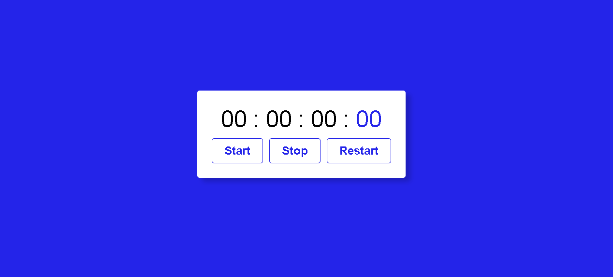
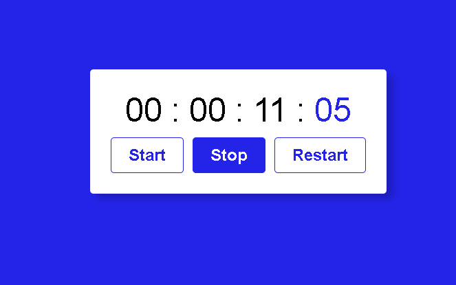

# Stopwatch
 > Stopwatch created  with Javascript
### This Project was created for i trainner my learn of javascript

> Some difficulted with this project
* The main problem i had, was the start and pause time, because i had no idea how add a number to the screen every second.
* Learn use setIterval, too was a problem in beggin, but i understood how to use.
* The problem with pause, was with scope, because where i used clearInterval, i had a problem to accessing variable.

> Project images

> Project Link
> https://samuellsantos.github.io/Stopwatch/
